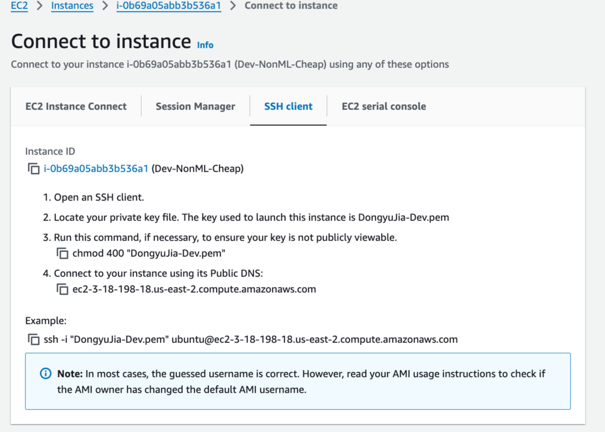

# Set up vscode with a dev machine on AWS

1. Create a dev machine(t3a.xlarge), and find ssh connection information. 
1. Note that such dev machine is around 4$ per day or 0.16$ per hour, so shutdown the machine when you exit your work and restart the instance when you gonna work, a smaller machine is not worth it as smaller machine can easily stuck and lost ssh connection completely.
1. Use VScode and connect to the EC2 instance, follow [this guide](https://medium.com/@christyjacob4/using-vscode-remotely-on-an-ec2-instance-7822c4032cff).
1. Some extensions are needed: Github Copilot, Remote SSH(Microsoft), Jupyter(Microsoft), Markdown All in One, Python(Microsoft)

# Set up your python environment

After your VScode connect to your EC2 instances, you can start setting up git repo and python env:

```
git clone https://github.com/Dongyu-Jia/LLM-RAG-Experiment.git
```

```
cd LLM-RAG-Experiment
bash setup/conda-setup.sh
```

# Run a function in Jupyter 

After you finish writing your python code, you want to test it out, sometimes running in Jupyter is easier than run in shell or Ipython:

1. use your vscode to open "dev/dev.ipynb" or create a new notebook
2. import functions you write and run it in the note book, you need to set up a few things before it can properly run:
   1. Need to select Kernel as "rag" first
   2. Need to run "import sys ; sys.path.append("..")" if the notebook is not directly under root folder, so it can use module in this repo.